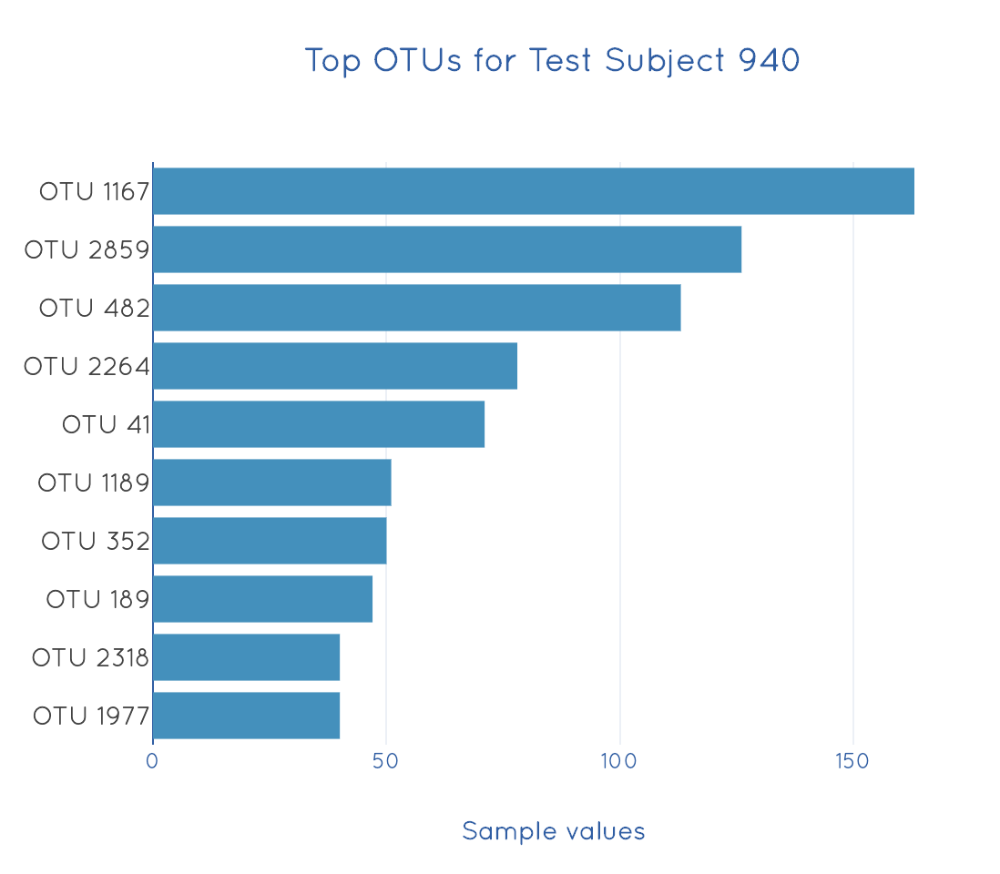
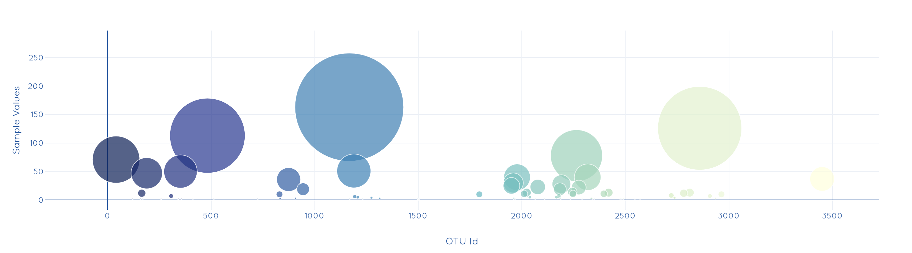
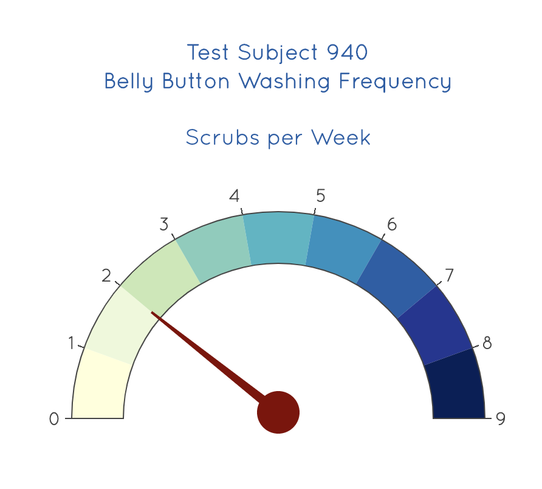

# Plot.ly Homework - Belly Button Biodiversity

## Background 
In this assignment, an interactive dashboard was built to explore the [Belly Button Biodiversity dataset](/data/samples.json), which catalogs the microbes that colonize human navels in JSON format.

The dataset reveals that a small handful of microbial species (also called operational taxonomic units, or OTUs, in the study) were present in more than 70% of people, while the rest were relatively rare.

Demographics information is dynamically populated based upon  a user-selected test subject ID. A bar chart, bubble chart and a bonus gauge chart also updates once the ID is changed. Code has been written using Plotly, JavaScript, HTML, CSS, and D3.js.

All CSS, JS and images required are under the `static` folder. The main HTML file `index.html` is in the root folder of the Github repo.

**The dashboard can be viewed here: [Belly Button Diversity Dashboard](https://neha-nayeem.github.io/plotly-challenge)**

## Plotly

The ask was to retrieve test subject demographics, and draw a bar chart and bubble chart displaying each individual's samples. This was done as follows:

* Read in `samples.json` using the D3 library

* Retrieve metadata info for each test subject and displaying this in the form of an unordered list item as a key-value pair on the dashboard.

* Get required data for plotting, including `sample_values`, `otu_ids` and `otu_labels` which were used to create a trace and plot the bar chart.

* Since the task was to only plot the top 10 values, the three arrays were sliced and reversed to display the chart as below.

  

* The entire sample arrays were used to plot a bubble chart.
  

* The bonus challenge was to create a gauge chart. Using the [documentation](https://plot.ly/javascript/gauge-charts/), an indicator trace was created with `wfreq` as the value for plotting. 

    * Any null values were given a value of zero.

    * The gauge chart accounts for weekly washing frequency values ranging from 0-9.

    * The default bar that indicates the value was set to transparent so that a needle pointer could be used on the chart.

    * To plot the pointer correctly, I referred to [this source](https://com2m.de/blog/technology/gauge-charts-with-plotly/) which explains the math behind the pointer angles.
  

* A function called `plotCharts(id)` was created that would take in a test subject ID as a parameter and plot all the above charts.

* A function called `resetData()` clears all the divs of the charts and demographic info.

* Another function `init()` calls the resetData() function, populates the dropdown menu with test subject IDs from the dataset and displays data of the first subject as a starting point.

* Everytime a new ID is selected from the dropdown (on change), an `optionChanged(this.value)` function is called, that resets the data once again and calls the `plotCharts()` function.

## Dashboard

Bootstrap and custom CSS was used to pretty up the dashboard. A screenshot of the dashboard can be seen below.

  

## Sources

* Hulcr, J. et al.(2012) _A Jungle in There: Bacteria in Belly Buttons are Highly Diverse, but Predictable_. Retrieved from: [http://robdunnlab.com/projects/belly-button-biodiversity/results-and-data/](http://robdunnlab.com/projects/belly-button-biodiversity/results-and-data/)

* Gauge Charts with Plotly (help with pointer needle): https://com2m.de/blog/technology/gauge-charts-with-plotly/

* Dashboard background photo by Elena Mozhvilo on [Unsplash](https://unsplash.com/photos/HRjdJddvPu8)
